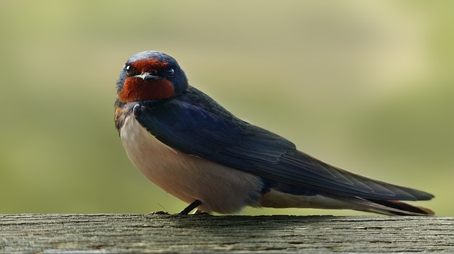

# Fråga 8

När får man jaga svalor i sverige?

**1** Jakten startar den 20 augusti klockan 12.00 och fortsätter fram till slutet av december

**X** Jakten startar den 20 augusti klockan 12.00 och fortsätter fram till slutet av oktober

**2** Aldrig, svalan är fridlyst
